## AIOZ AI CLI

Linux amd64 demo of the AIOZ AI operator CLI.

## What is AIOZ AI CLI?

AIOZ AI CLI (`ai-cli`) is a command-line application that runs an AIOZ AI node on your machine, takes AI tasks, and earns AIOZ rewards.

This GitHub repository is **download + version-check only**. It is not the source tree. Only the **latest** release is kept.

## Requirements

- Linux amd64 (`x86_64`)
- Ubuntu 20.04 or similar is fine

macOS, Windows, and other architectures are not published here.

## Getting started

Install **`ai-cli` only**. The node runtime and keytool are bundled inside the binary and extracted on first use.

```bash
curl -fsSL https://github.com/DiseAgon/aioz-ai-cli-demo/releases/latest/download/install.sh | bash
source ~/.bashrc
```

`install.sh` verifies the signed `manifest.json` (Ed25519) and SHA-256, then installs `~/.local/bin/ai-cli`.

Verify the installation:

```bash
ai-cli version
```

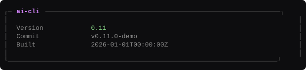

Create a node credential file (mode `0600`). This does not create a data folder.

```bash
ai-cli keytool new --save-priv-key priv.json
```

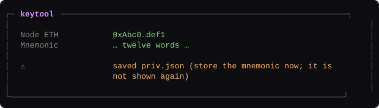

`--save-priv-key` writes the private key JSON. Store the mnemonic now; it is not shown again.

**IMPORTANT**

- Treat `priv.json` and the mnemonic as **wallet secrets**. Anyone who has them can control this node's rewards.
- Use a **dedicated key for each node**. Do not reuse a main wallet, exchange key, or another node's key.
- Keep an offline backup. **Never paste** the mnemonic or private key into websites, chats, or support tickets.

Set a storage cap **before** start. The value must be **greater than 2 GB**. There is no 2 GB default.

```bash
ai-cli storage limit 10 --priv-key-file priv.json
```

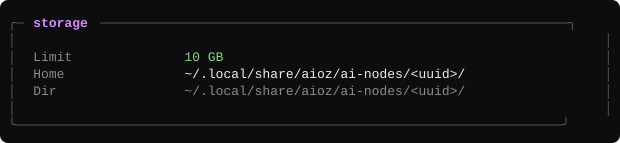

Start the node. Ctrl+C stops **this wallet only**.

```bash
ai-cli start --priv-key-file priv.json
```

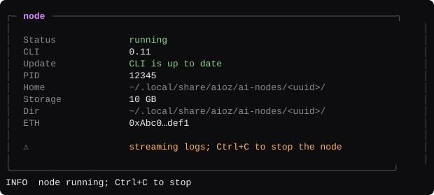

`--priv-key-file` is required. You do not need `--home` for the default layout. Data for this wallet is `~/.local/share/aioz/ai-nodes/<uuid>/`. The wallet label is `identity/address` (next to the pid file), not the folder name.

A second credential file (`priv_2.json`) is a second wallet and a second node.

Update the CLI:

```bash
ai-cli update
```

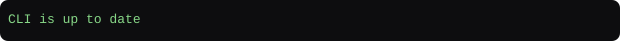

## Usage

### Status

```bash
ai-cli status --priv-key-file priv.json
```

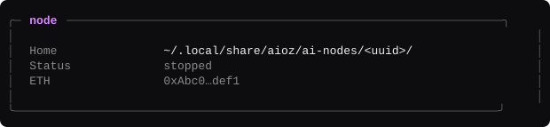

```bash
ai-cli status --all
```

Lists every home on this machine. Does not need `--priv-key-file`.

### Logs

```bash
ai-cli logs --priv-key-file priv.json
```

Tails this wallet's `ai.log` (redacted on screen).

### Stats

```bash
ai-cli stats --priv-key-file priv.json
```

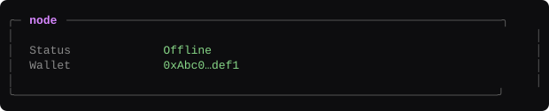

### Storage

```bash
ai-cli storage show --priv-key-file priv.json
```

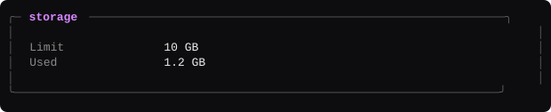

Warns when used is at least 90% of the cap.

```bash
ai-cli storage limit 20 --priv-key-file priv.json
```

Must be greater than 2 GB. Applied on the next `start`.

### Reward balance

```bash
ai-cli reward balance --priv-key-file priv.json
```

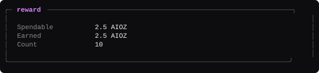

Works with the node off.

### Withdraw

```bash
ai-cli reward withdraw --priv-key-file priv.json --amount 1.5 --address 0x… --yes
```

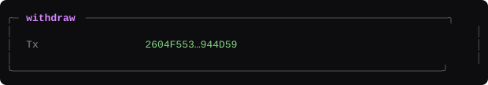

Destination is a MetaMask `0x` on AIOZ Chain. Minimum withdraw is **0.01 AIOZ**.

### Doctor

```bash
ai-cli doctor --priv-key-file priv.json
```

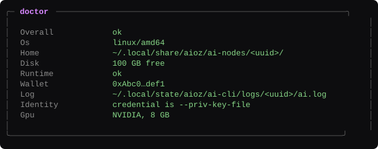
